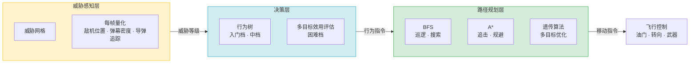

# Dogfight Threat AI

> 基于实时威胁评估与动态决策的 2D 飞机对战系统

---

## 目录

- [Dogfight Threat AI](#dogfight-threat-ai)
  - [目录](#目录)
  - [项目简介](#项目简介)
  - [系统架构](#系统架构)
    - [网络拓扑](#网络拓扑)
    - [AI 三层架构](#ai-三层架构)
  - [目录结构](#目录结构)
  - [技术栈](#技术栈)
  - [团队成员](#团队成员)
  - [Git 协作流程](#git-协作流程)
    - [分支策略](#分支策略)
    - [第一次上手（VS Code）](#第一次上手vs-code)
    - [提交信息规范](#提交信息规范)
    - [Pull Request 流程](#pull-request-流程)
    - [冲突解决（VS Code）](#冲突解决vs-code)
  - [环境搭建](#环境搭建)
    - [客户端](#客户端)
    - [服务器](#服务器)
    - [AI 测试工具](#ai-测试工具)
  - [开发约定](#开发约定)
  - [许可证](#许可证)
- [附录](#附录)
  - [附录一：成员简介](#附录一成员简介)
    - [ycccuc](#ycccuc)


---

## 项目简介

本项目构建一个具备**实时战场威胁感知**与**动态策略切换**能力的 2D 多人在线空战游戏。系统以 Unity 2D 为客户端引擎、C# 为后台语言，采用客户端-网关-逻辑服务器三层架构，实现：

- **物理化 2D 飞行操控** — Rigidbody2D 驱动的惯性滑行、转向阻尼与速度约束
- **三级自适应 AI 对手** — 基于实时威胁网格评估，在 BFS、A\*、遗传算法之间动态组合
- **多人联机对战** — 人人 / 人机 / AI 自动三种模式，房间管理 + 观战 + 文字交流

> 湖北省大学生创新训练项目 · 2026.6 – 2027.5

---

## 系统架构

### 网络拓扑

```mermaid
flowchart LR
    subgraph Client[" 表现层 · Unity 2D"]
        direction TB
        A["场景渲染<br/>视差卷轴 · 粒子特效"]
        B["飞行操控<br/>Rigidbody2D 物理"]
        C["抬头显示 / 雷达<br/>血量 · 速度 · 武器"]
    end

    subgraph Gateway[" 接入层 · 网关服务器"]
        direction TB
        D["连接认证<br/>断线重连"]
        E["消息路由<br/>协议解析 · 转发"]
        F["房间管理<br/>创建 · 加入 · 观战"]
    end

    subgraph Logic[" 逻辑层 · 逻辑服务器"]
        direction TB
        G["碰撞检测<br/>服务器权威"]
        H["战斗规则<br/>伤害 · 得分"]
        I["状态同步<br/>广播"]
        J["AI 对战<br/>自动对局调度"]
    end

    Client <-->|"TCP / UDP · JSON"| Gateway
    Gateway <-->|"消息转发"| Logic

    style Client fill:#d1ecf1,stroke:#17a2b8
    style Gateway fill:#fff3cd,stroke:#ffc107
    style Logic fill:#e8daef,stroke:#8e44ad
```



> 三层架构各司其职：**表现层**只做渲染和输入，**接入层**只做路由和房间，**逻辑层**持有所有战斗状态和 AI 计算。客户端不直接与逻辑服务器通信——所有消息经网关中转，便于后续扩展为多网关集群。

### AI 三层架构



> 数据单向流动：**感知**→**决策**→**规划**→**控制**，每层只依赖上一层的输出。三个算法模块（BFS、A\*、遗传算法）在路径规划层中按难度档位独立替换，不影响决策层逻辑。

```

### 三档难度对照

| 档位 | 决策层 | 路径规划层 | 行为特征 |
|------|--------|-----------|---------|
| 入门 | 行为树 | BFS | 固定搜索航线，正面对抗 |
| 中档 | 行为树 | A\* | 威胁感知追击，低风险规避 |
| 困难 | 多目标效用评估 | 遗传算法 | 多目标动态优化，自主策略切换 |

```

---

## 目录结构

```

dogfight-threat-ai/
│
├── README.md                   ← 你在这里
├── LICENSE                     MIT 协议
├── .gitignore                  Unity 标准忽略规则
│
├── docs/                       文档
│   ├── requirements/           需求分析文档
│   ├── design/                 系统设计文档
│   ├── manuals/                用户操作手册
│   └── reports/                中期报告 · 结题报告
│
├── src/                        源码
│   ├── client/
│   │   └── DogfightThreatAI/   Unity 2D 客户端工程
│   ├── server/
│   │   ├── GatewayServer/      网关服务器 (独立 .sln)
│   │   └── LogicServer/        逻辑服务器 (独立 .sln)
│   └── shared/
│       └── Protocol/           共享消息协议定义 (JSON)
│
├── assets/                     原始素材（入库前）
│   ├── sprites/                战机精灵 · 背景 · UI
│   ├── audio/                  音效 · 背景音乐
│   └── vfx/                    粒子贴图 · 爆炸序列帧
│
├── tools/
│   └── ai-benchmark/           AI 批量对战 & 胜率统计
│
└── tests/                      自动化测试

```

| 目录 | 用途 |
|------|------|
| `docs/` | 所有文字产出（需求、设计、报告） |
| `src/client/` | Unity 工程，场景 / 脚本 / 预制体 |
| `src/server/` | C# 控制台，网关 + 逻辑 |
| `src/shared/` | 前后端共用的消息协议定义 |
| `assets/` | 原始素材文件，导入 Unity 前的源文件 |
| `tools/` | 开发辅助脚本，AI 测试工具 |
| `tests/` | 单元测试 / 集成测试 |

> 1.注意：gitkeep不要删，Git 只跟踪文件，不跟踪空文件夹。比如你建了 docs/reports/，里面啥也没有，git add 之后这个文件夹不会出现在仓库里。放一个 .gitkeep 进去，Git 就会把这个文件夹也纳入版本控制。
> 2.现在 docs/、assets/、tools/ 下面都是空的，但目录结构已经搭好了。如果不用 .gitkeep，我push之后，你们 clone 下来只会看到 src/server/ 这种已经有文件的目录，空的统统消失——那 README 里写的目录说明和实际结构就对不上了。
> 3.后续我统一删
---

## 技术栈

| 层 | 技术 | 说明 |
|----|------|------|
| 客户端引擎 | Unity 2D (LTS) | Sprite 渲染 · Rigidbody2D 物理 · 粒子系统 |
| 客户端脚本 | C# (.NET Standard 2.1) | MonoBehaviour · 输入系统 |
| 网关服务器 | C# 控制台 (.NET 8) | TCP 长连接 · 消息路由 |
| 逻辑服务器 | C# 控制台 (.NET 8) | 帧同步 · 碰撞权威 · AI 调度 |
| 网络通信 | TCP (指令) + UDP (状态) | Socket · 自定义 JSON 协议 |
| AI 算法 | C# | 行为树 · BFS · A\* · 遗传算法 |
| 版本控制 | Git + GitHub | 分支协作（见下方工作流） |

---

## 团队成员

> 点击网名跳转到个人简介。各成员克隆仓库后填入自己信息并提交 PR。

| 网名 | GitHub | 负责模块 |
|------|--------|---------|
| [ycccuc](#ycccuc) | [@ycccuc](https://github.com/ycccuc) | 架构设计 |
| [（你的网名）](#你的网名) | [@](https://github.com/) | （你的模块） |
| [（你的网名）](#你的网名) | [@](https://github.com/) | （你的模块） |
| [（你的网名）](#你的网名) | [@](https://github.com/) | （你的模块） |
| [（你的网名）](#你的网名) | [@](https://github.com/) | （你的模块） |

---

## Git 协作流程

### 分支策略

```
main ─────●────────●──────────●──────  （保护分支，只接受 PR 合并）
           \        \          /
dev  ───────●────────●────────●───────  （开发集成分支）
             \        \        \
feature-xxx ──●──●     \        \      （个人功能分支）
                        \
feature-yyy ─────────────●──●────────
```

> 流程即：feature/xxx  ──  dev   ──  main
>  所以说就是从 (个人PR) 到  (集成PR)再到 (最终)

| 分支 | 用途 | 谁可以 push |
|------|------|-------------|
| `main` | 稳定可运行版本 | 仅负责人（通过 PR） |
| `dev` | 日常开发集成 | 全员（通过 PR） |
| `feature/<功能名>` | 单个功能开发 | 个人自由 push |

### 第一次上手（VS Code）

> 以下操作全部在 VS Code 内完成，不需要打开终端。

**1. 克隆仓库**

`F1` → 输入 `Git: Clone` → 粘贴仓库地址：
```
https://github.com/ycccuc/dogfight-threat-ai.git
```
选择本地文件夹保存。

**2. 从 `dev` 创建你的功能分支**

左下角点击当前分支名 → `Create branch from...` → 选择 `origin/dev` → 命名 `feature/你的功能名`。

**3. 日常开发 → 提交**

左侧 `Source Control` 面板（Ctrl+Shift+G）：
- 修改过的文件会出现在 Changes 列表
- 点击文件可查看改动对比
- 在 Message 框输入提交信息（见下方规范）→ 点击 `✓ Commit`
- 点击 `Sync Changes` 推送到 GitHub

**4. 发起 Pull Request**

推送后 VS Code 右下角会弹出通知，点击 `Create Pull Request`，或去 GitHub 仓库页面手动创建。**目标分支选 `dev`**。

### 提交信息规范

```
feat:     新功能      feat: 添加导弹追踪逻辑
fix:      修 Bug      fix: 修复碰撞层未设置导致穿透
docs:     文档改动    docs: 更新需求文档第三章
refactor: 重构        refactor: 抽取武器基类
test:     测试        test: 补充 BFS 寻路单元测试
chore:    杂项        chore: 更新 .gitignore
```

**规则：**
- 前缀小写英文，冒号后一个空格，中文描述
- 一个 commit 只做一件事
- **禁止 Force Push** — VS Code 默认不会 force push，不用操心

### Pull Request 流程

1. 推送后在 GitHub 上从 `feature/xxx` 创建 PR，目标分支选 `dev`
2. PR 标题写清楚做了什么，描述里附截图或 Unity 运行结果
3. 指定至少一人 Review
4. Review 通过后点击 **"Squash and merge"** 合并
5. 合并后在 VS Code 左下角切回 `dev` 分支 → `Pull` 拉取最新代码

### 冲突解决（VS Code）

当 GitHub 上 PR 显示冲突时：

1. VS Code 左下角切到 `dev` → 点击 `Sync` 拉取最新
2. 切回你的 `feature/xxx` 分支
3. `F1` → `Git: Merge Branch...` → 选择 `dev`
4. 如果弹出冲突文件，VS Code 会高亮标记 `<<<<<<<` 和 `>>>>>>>`
5. 逐文件点击 `Accept Current` / `Accept Incoming` / `Accept Both` 解决冲突
6. 全部解决后 → `Stage Changes` → `Commit` → `Sync` 推送

---

## 环境搭建

### 客户端

1. 安装 [Unity Hub](https://unity.com/download) → 安装 Unity 2022.3 LTS（或更新 LTS）
2. 通过 Unity Hub 打开 `src/client/DogfightThreatAI/`
3. 等待资源导入完成，点击 Play 运行

### 服务器

1. 安装 [.NET 8 SDK](https://dotnet.microsoft.com/download)
2. 分别打开两个 solution：
   ```bash
   cd src/server/GatewayServer
   dotnet restore
   dotnet run

   cd src/server/LogicServer
   dotnet restore
   dotnet run
   ```

### AI 测试工具

```bash
cd tools/ai-benchmark
dotnet run -- --rounds 100 --ai1 beginner --ai2 intermediate
```

---

## 开发约定

- **编码**：UTF-8，缩进 4 空格
- **命名**：C# 类名 PascalCase，变量 camelCase，常量 UPPER_SNAKE
- **Unity**：场景放 `Assets/_Scenes/`，脚本放 `Assets/_Scripts/`，预制体放 `Assets/_Prefabs/`
- **消息协议**：前后端共用 `src/shared/Protocol/` 下的 JSON Schema，修改需两边同步确认
- **资源规范**：原始素材先放 `assets/` 再导入 Unity，不直接在 Unity 里改源文件

---

## 许可证

本项目基于 [MIT License](./LICENSE) 开源。

---

# 附录

## 附录一：成员简介

### ycccuc
我是无敌ycccuc大王


> 最后更新：2026-06-07
